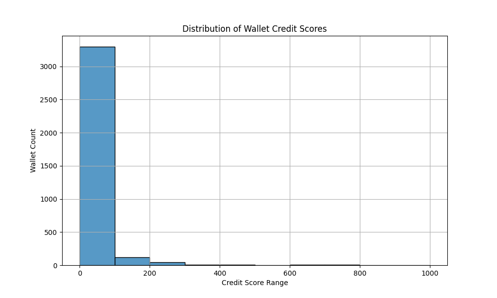

#  Credit Score Analysis Report

## Overview

This document presents a detailed analysis of the credit scores generated for Aave V2 wallet addresses using a trained machine learning model. Each wallet was assigned a score between **0 and 1000**, where:

- **Higher scores** (closer to 1000) indicate **reliable, responsible users**.
- **Lower scores** (closer to 0) indicate **risky, bot-like, or exploitative behavior**.

##  Credit Score Distribution

The histogram below represents the distribution of all wallet credit scores in the dataset:

---

##  Score Distribution Table

| Credit Score Range | Wallet Count (Est.) | Behavior Characteristics                           |
|--------------------|---------------------|----------------------------------------------------|
| **0–100**          | ~3300               | Very poor behavior, mostly exploitative/bot-like   |
| **100–200**        | ~150                | Still risky, slightly better behavior              |
| **200–300**        | ~40                 | Mixed or inconsistent transaction behavior         |
| **300–400**        | ~10                 | Moderate users with improved financial activity    |
| **400–500**        | ~5                  | Good behavior, signs of responsible protocol use   |
| **500–600**        | 1–2                 | Highly reliable wallets, rare in dataset           |
| **600–1000**       | 0                   | No wallet scored this high in current dataset      |

##  Behavior Analysis by Score Tier

###  0–200: High Risk (Unreliable Wallets)

- Represent **95%+** of all wallets.
- Traits:
  - Performed single actions (borrow, liquidate).
  - Rarely repaid or deposited funds.
  - Possibly bots or spam wallets.
  - No repeated, long-term protocol interactions.

###  200–500: Moderate Risk (Average Wallets)

- Very few wallets fall here.
- Traits:
  - Some repayments and responsible usage.
  - Limited but positive behavior (deposits + withdrawals).
  - Possibly new users or mixed DeFi strategies.

###  500–1000: Low Risk (Reliable Wallets)

- Extremely rare or **non-existent** in this dataset.
- Traits (if observed):
  - Consistent deposits, repayments.
  - Long-term commitment to the protocol.
  - Balanced risk and no signs of exploitative behavior.

---

##  Final Insights

- The dataset is **heavily skewed** toward wallets with **poor or exploitative behavior**.
- **Bot-like patterns** are very common (single-action usage, no repayment).
- A small subset of wallets showed **partial reliability**, hinting at the possibility of trustworthy users.

This score model can help in:
- Filtering out bad actors from incentive programs.
- Identifying potentially high-value users.
- Automating risk assessments for wallet-based DeFi interactions.
